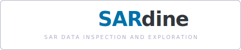
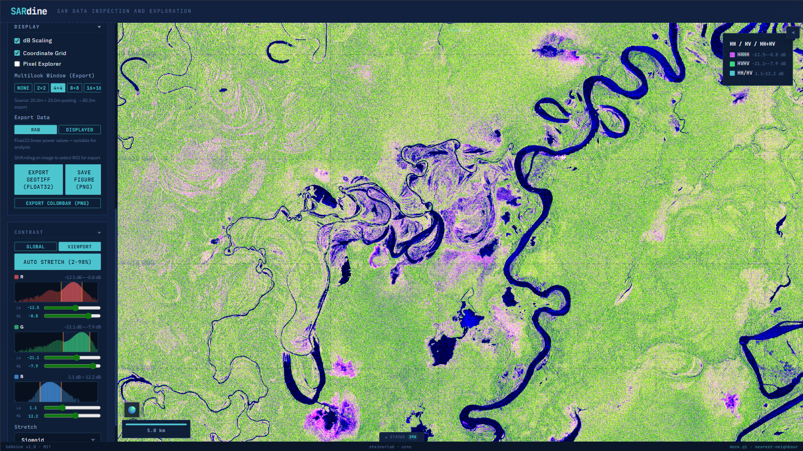

<div align="center">

<picture>
  <source media="(prefers-color-scheme: dark)" srcset="docs/sardine-logo.svg">
  <source media="(prefers-color-scheme: light)" srcset="docs/sardine-logo-light.svg">
  
</picture>

<br>

**SAR Data INspection and Exploration**

*Browser-native SAR analysis — cloud-optimized HDF5 and COG streaming to GPU*

`v1.0.0-beta.2` · `MIT` · `Feb 2026`



</div>

> **This project is under active development.** Some features are experimental or incomplete. Known issues include ROI overlay alignment drift during pan/zoom, and incidence angle masking requires NISAR HDF5 files with a metadata cube. Bug reports welcome via [GitHub Issues](https://github.com/nicksteiner/sardine/issues).

---

## Overview

SARdine runs SAR analysis entirely in the browser.

It reads NISAR L2 GCOV HDF5 (`.h5`) and Cloud Optimized GeoTIFFs from any vendor. Rendering goes through WebGL2 shaders on deck.gl: dB scaling, colormaps, contrast, polarimetric composites — all on the GPU at 60 fps.

### Core Capabilities

- **NISAR GCOV HDF5 streaming** — local files and HTTP Range, cloud-optimized chunk reading via h5chunk.js
- **Cloud Optimized GeoTIFF loading** — ICEYE, Capella, Umbra, Sentinel-1, anything with geotiff.js
- **GPU-accelerated rendering** — dB scaling, colormaps, and contrast stretching in GLSL shaders
- **RGB composites** — Pauli, dual-pol, quad-pol, Freeman-Durden with per-channel contrast
- **Stretch modes** — linear, sqrt, gamma, sigmoid transfer functions

### Analysis Tools

- **Viewport histogram** — floating histogram panel that auto-updates as you pan/zoom, with per-channel stats for RGB composites
- **Feature space classifier** — draw an ROI, open the 2D scatter plot (e.g. HH dB vs HV dB), define class regions by drawing rectangles, and see the classification overlay on the map in real time
- **Incidence angle masking** — filter classified pixels by incidence angle range using the NISAR metadata cube (NISAR HDF5 only)
- **Pixel explorer** — hover to inspect raw values at any pixel location

### Export

- **GeoTIFF** — raw Float32 with CRS + tiepoints, rendered RGBA, or RGB composite
- **Figure PNG** — canvas capture with scale bar, coordinates, colorbar, and classification overlay
- **Publication SVG** — Journal-style vector export of scatter plots, histograms, and classification maps

---

## Quick Start

SARdine requires **Node.js** (v18 or later) and **npm**.

```bash
git clone https://github.com/nicksteiner/sardine.git
cd sardine
npm install
npm run dev
```

Open **http://localhost:5173** in Chrome, Edge, or Firefox (WebGL2 required).

### Installing Node.js

**macOS:** `brew install node` or download from https://nodejs.org/

**Windows:** Download the installer from https://nodejs.org/ (LTS recommended).

**Linux (Debian/Ubuntu):**
```bash
curl -fsSL https://deb.nodesource.com/setup_lts.x | sudo -E bash -
sudo apt-get install -y nodejs
```

---

## Loading Data

Pick a mode from the **File Type** dropdown in the left panel.

### Local HDF5 Files

1. **File Type** → **NISAR GCOV HDF5 (Local File)**
2. **Choose File** → pick your `.h5`
3. Pick **Frequency** (`frequencyA` = L-band, `frequencyB` = S-band)
4. Pick **Polarization** (`HHHH`, `HVHV`, `VVVV`, etc.)
5. Optionally switch to **RGB Composite** and pick a preset
6. **Load Dataset**

Nothing gets uploaded. Chunks are read directly from disk via the browser File API. GCOV files are 2–20 GB but only viewport-intersecting chunks get read.

### Presigned URLs (S3 / HTTPS)

1. **File Type** → **Remote Bucket / S3**
2. Paste the presigned URL into **Direct URL**
3. **Load from URL** — metadata arrives via Range requests (~8 MB)
4. Pick frequency and polarization → **Load Remote Dataset**

File type is detected from the path: `.h5`/`.hdf5`/`.he5` → NISAR, `.tif`/`.tiff` → COG.

### COG URLs

1. **File Type** → **Cloud Optimized GeoTIFF (URL)**
2. Paste URL (presigned or public)
3. **Load COG**

---

## Controls

| Control | Description |
|:---|:---|
| **Colormap** | Grayscale, viridis, inferno, plasma, phase, sardine, flood, diverging, polarimetric |
| **Contrast** | Min/max dB range — drag sliders or use **Auto** for percentile-based stretch |
| **Stretch** | Linear, sqrt, gamma, sigmoid transfer function |
| **Multi-look** | Speckle reduction (box-filter averaging in linear power) |
| **Histogram** | Floating viewport histogram — auto-updates on pan/zoom, SVG export |
| **Classifier** | 2D feature space scatter with class region drawing and incidence angle filter |
| **Basemap** | Toggle MapLibre basemap under SAR data |
| **Overture** | Overlay buildings, roads, or places from Overture Maps |

### Keyboard Shortcuts

| Key | Action |
|:---|:---|
| `H` | Toggle histogram overlay |
| `C` | Toggle feature space classifier |
| `F` | Fit view to data bounds |
| `R` | Reset contrast to auto |
| `G` | Toggle coordinate grid |
| `M` | Toggle overview map |
| `Ctrl+S` | Save figure (PNG) |

---

## Classification Workflow

1. Draw an **ROI** on the map (click and drag)
2. Press `C` to open the **Feature Space** scatter plot
3. Click **+ Add Class** to define a land cover class
4. Draw a rectangle on the scatter plot to assign pixels in that dB range
5. Pixels within the class region are colored on the map in real time
6. Adjust the **Incidence Angle Filter** sliders to mask near/far range (NISAR HDF5 only)
7. Export: **SVG** for the scatter plot, **Map** for the classification raster

---

## Export

### GeoTIFF

- **Raw Float32** — linear power values with CRS + tiepoints
- **Rendered RGBA** — what you see on screen (dB, colormap, contrast) as a 4-band GeoTIFF
- **RGB Composite** — 3-band GeoTIFF when in composite mode

Draw an ROI to export a subregion, or export the full extent.

### Figure PNG

Canvas capture with overlays: scale bar, corner coordinates, colorbar (or RGB triangle for composites), and classification overlay.

### Publication SVG

Journal-style vector graphics:
- **Scatter plot** — density heatmap with class regions, open L-axes, outward ticks, Helvetica
- **Histogram** — filled distribution with contrast limit markers and legend
- **Classification map** — embedded raster with vector legend and pixel counts

---

## Known Issues

| Issue | Status |
|:---|:---|
| ROI overlay drifts during pan/zoom — classification canvas does not track the viewport correctly | Open |
| Incidence angle slider only appears for NISAR HDF5 with metadata cube (not COGs) | By design |
| Large ROIs may be slow to classify (data is downsampled to ~256 px on longest axis) | Expected |
| Histogram recompute on pan/zoom has 800 ms debounce — may lag during fast navigation | Expected |

---

## CORS Setup

Remote files require the bucket to allow cross-origin Range requests. For S3:

```json
[
  {
    "AllowedHeaders": ["*"],
    "AllowedMethods": ["GET", "HEAD"],
    "AllowedOrigins": ["*"],
    "ExposeHeaders": ["Content-Range", "Content-Length", "Accept-Ranges"],
    "MaxAgeSeconds": 3600
  }
]
```

**GCS:** `gsutil cors set cors.json gs://your-bucket`
**Azure Blob:** configure CORS rules in the storage account settings.

---

## Server Mode (JupyterHub / NISAR ODS)

```bash
cd ~/sardine
npm install --legacy-peer-deps && npm run build
node server/launch.cjs --data-dir /home/jovyan
```

Access via JupyterLab proxy: `https://<hub-host>/user/<username>/proxy/8050/`

---

## Architecture

```
File/URL → Loader → Chunks → GPU Texture → GLSL Shader → Screen
                                              ↓
                                    dB scale → stretch → colormap → contrast
```

### HDF5 Streaming

`h5chunk` is a JS-native Kerchunk. Reads cloud-optimized HDF5 without loading the full file:

1. Fetch metadata page (~8 MB, one request)
2. Parse HDF5 superblock, object headers, B-tree → build chunk index
3. For current viewport, calculate intersecting chunks
4. Fetch chunks via `File.slice()` (local) or HTTP Range (remote)
5. Decompress (deflate + shuffle) → Float32Array
6. Upload as WebGL2 R32F texture
7. Fragment shader: power → dB → normalize → stretch → colormap → RGBA

### Tech Stack

| Dependency | Role |
|:---|:---|
| **React 18** | UI framework |
| **deck.gl 8.9** | WebGL tile/bitmap rendering |
| **geotiff.js** | COG loading via HTTP Range |
| **h5chunk** (built-in) | Cloud-optimized HDF5 streaming |
| **h5wasm** | HDF5 attribute/metadata parsing (WASM) |
| **MapLibre GL** | Basemap rendering |
| **Vite** | Dev server and build tool |

---

## Development

```bash
npm install          # Install dependencies
npm run dev          # Dev server at localhost:5173
npm run build        # Production build → dist/
npm test             # Full test suite (100+ checks)
npm run test:quick   # Fast smoke tests
npm run benchmark    # GPU vs CPU performance comparison
```

---

## Roadmap

| Feature | Status |
|:---|:---|
| NISAR GCOV HDF5 local + remote streaming | Done |
| Cloud Optimized GeoTIFF loading | Done |
| GPU dB scaling + colormaps + stretch modes | Done |
| RGB polarimetric composites (Pauli, dual-pol, quad-pol) | Done |
| Freeman-Durden decomposition | Done |
| Viewport histogram with auto-update | Done |
| Feature space scatter classifier | Done |
| Incidence angle masking (NISAR) | Done |
| Publication SVG export (scatter, histogram, class map) | Done |
| GeoTIFF + figure export | Done |
| Overture Maps vector overlay | Done |
| STAC catalog search | Done |
| ROI overlay alignment fix | In Progress |
| B-tree v2 parsing | Next |
| Worker thread decompression | Next |
| Chat-driven visualization control | Planned |
| Drawing / annotation tools | Planned |
| GUNW / InSAR phase visualization | Planned |

---

## License

MIT

---

<sub>

[h5wasm](https://github.com/usnistgov/h5wasm) · [geotiff.js](https://geotiffjs.github.io/) · [deck.gl](https://deck.gl/) · NISAR cloud-optimization: [NSIDC](https://nsidc.org/) + JPL

`CCNY Earth & Atmospheric Sciences`

</sub>
