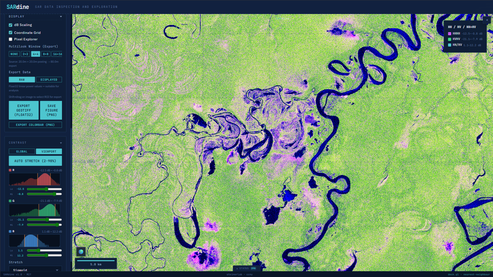

<div align="center">

<picture>
  <source media="(prefers-color-scheme: dark)" srcset="docs/sardine-logo.svg">
  <source media="(prefers-color-scheme: light)" srcset="docs/sardine-logo-light.svg">
  
</picture>

<br>

**SAR Data INspection and Exploration**

*Browser-native visualization and export for NISAR HDF5 and Cloud Optimized GeoTIFFs*

`v1.0.0-beta.3' · `Mar 2026`



</div>

> **This project is under active development.** Some features are experimental or incomplete. Bug reports welcome via [GitHub Issues](https://github.com/nicksteiner/sardine/issues).

---

## What It Is

SARdine is a browser-native exploration and visualization GUI for NISAR HDF5 data. Drop in a file, explore the data, and export a figure or georeferenced dataset — no install beyond a web browser, no Python, no server.

It reads NISAR L2 GCOV HDF5 (`.h5`) directly using a custom JavaScript HDF5 reader (`h5chunk`). Rendering happens entirely on the GPU via WebGL2 shaders: dB scaling, colormaps, contrast stretching, and polarimetric composites all run at 60 fps. GCOV/GUNW files are 2–8 GB but only viewport-intersecting chunks are ever read.

---

## What You Can Do

**Explore full-resolution SAR data**
Drop in a large NISAR file and pan/zoom through it at full resolution. Switch polarizations (HH, HV, VV), adjust contrast with the live histogram, and apply stretch modes (linear, sqrt, gamma, sigmoid).

**Make publication-ready figures**
Enable the dual-pol RGB composite for multi-channel decomposition. Export a georeferenced figure PNG with scale bar, corner coordinates, and colorbar. Export scatter plots and histograms as publication SVGs.

**Classify and map land cover**
Draw an ROI, open the 2D feature space scatter (e.g. HH dB vs HV dB), define class regions by drawing rectangles, and see the classification overlay on the map in real time. Filter by incidence angle range (NISAR HDF5 only).

**Subset and export data**
Draw an ROI and export a subregion as a raw Float32 GeoTIFF (linear power, with CRS and tiepoints) or a rendered RGBA GeoTIFF. Works for both single-pol and RGB composites.

**Time series and change detection**
Load multiple dates for ROI time series plotting, or compose a multi-date RGB composite for change detection visualization.

**Stream from S3**
Paste a presigned URL and stream directly from a bucket — same workflow, no download required.

---

## Quick Start

SARdine requires **Node.js** (v18 or later) and **npm**.

```bash
git clone https://github.com/nicksteiner/sardine.git
cd sardine
npm install
npm run dev
```

Open **http://localhost:5173** in Chrome, Edge, or Firefox (WebGL2 required).

### Installing Node.js

**macOS:** `brew install node` or download from https://nodejs.org/

**Windows:** Download the installer from https://nodejs.org/ (LTS recommended).

**Linux (Debian/Ubuntu):**
```bash
curl -fsSL https://deb.nodesource.com/setup_lts.x | sudo -E bash -
sudo apt-get install -y nodejs
```

---

## Loading Data

Pick a mode from the **File Type** dropdown in the left panel.

### Local HDF5 Files

1. **File Type** → **NISAR GCOV HDF5 (Local File)**
2. **Choose File** → pick your `.h5`
3. Pick **Frequency** (`frequencyA` = high res, `frequencyB` = low res)
4. Pick **Polarization** (`HHHH`, `HVHV`, `VVVV`, etc.)
5. Optionally switch to **RGB Composite** and pick a preset
6. **Load Dataset**

Nothing is uploaded. Chunks are read directly from disk via the browser File API.

### Presigned URLs (S3 / HTTPS)

1. **File Type** → **Remote Bucket / S3**
2. Paste the presigned URL into **Direct URL**
3. **Load from URL** — metadata arrives via Range requests (~8 MB)
4. Pick frequency and polarization → **Load Remote Dataset**

File type is detected from the path: `.h5`/`.hdf5`/`.he5` → NISAR, `.tif`/`.tiff` → COG.

### COG URLs

1. **File Type** → **Cloud Optimized GeoTIFF (URL)**
2. Paste URL (presigned or public)
3. **Load COG**

---

## Controls

| Control | Description |
|:---|:---|
| **Colormap** | Grayscale, viridis, inferno, plasma, phase, sardine, flood, diverging, polarimetric |
| **Contrast** | Min/max dB range — drag sliders or use **Auto** for percentile-based stretch |
| **Stretch** | Linear, sqrt, gamma, sigmoid transfer function |
| **Multi-look** | Data reduction (box-filter averaging in linear power) |
| **Histogram** | Floating viewport histogram — auto-updates on pan/zoom, SVG export |
| **Classifier** | 2D/1D feature space scatter with class region drawing and incidence angle filter |
| **Overture** | Overlay boundaries, roads, or places from Overture Maps |

### Keyboard Shortcuts

| Key | Action |
|:---|:---|
| `H` | Toggle histogram overlay |
| `C` | Toggle feature space classifier |
| `F` | Fit view to data bounds |
| `R` | Reset contrast to auto |
| `G` | Toggle coordinate grid |
| `M` | Toggle overview map |
| `Ctrl+S` | Save figure (PNG) |

---

## Classification Workflow

1. Draw an **ROI** on the map (click and drag)
2. Press `C` to open the **Feature Space** scatter plot
3. Click **+ Add Class** to define a land cover class
4. Draw a rectangle on the scatter plot to assign pixels in that dB range
5. Pixels within the class region are colored on the map in real time
6. Export: **SVG** for the scatter plot, **Map** for the classification raster

---

## Export

### GeoTIFF

- **Raw Float32** — linear power values with CRS and tiepoints
- **Rendered RGBA** — what you see on screen (dB, colormap, contrast) as a 4-band GeoTIFF
- **RGB Composite** — 3-band GeoTIFF when in composite mode

Draw an ROI to export a subregion, or export the full extent.

### Figure PNG

Canvas capture with overlays: scale bar, corner coordinates, colorbar (or RGB triangle for composites), and classification overlay.

### Publication SVG

Vector graphics:
- **Scatter plot** — density heatmap with class regions, open L-axes, outward ticks, Helvetica
- **Histogram** — filled distribution with contrast limit markers and legend
- **Classification map** — embedded raster with vector legend and pixel counts

---

## How It Works

```
File/URL → h5chunk → Chunks → GPU Texture → GLSL Shader → Screen
                                                ↓
                                   dB scale → stretch → colormap → contrast
```

`h5chunk` is a pure JavaScript HDF5 chunk reader — no GDAL, no WASM, no server. It parses the HDF5 superblock, object headers, and B-tree to build a chunk index, then fetches only the chunks intersecting the current viewport via `File.slice()` (local) or HTTP Range (remote). Chunks are decompressed (deflate + shuffle) into Float32Arrays and uploaded directly as WebGL2 textures. The fragment shader handles the rest.

GCOV and GUNW products are supported. GUNW (interferometric phase and coherence) is developmental.

### Tech Stack

| Dependency | Role |
|:---|:---|
| **React 18** | UI framework |
| **deck.gl 8.9** | WebGL tile/bitmap rendering |
| **geotiff.js** | COG loading via HTTP Range |
| **h5chunk** (built-in) | Cloud-optimized HDF5 streaming (pure JS) |
| **h5wasm** | HDF5 attribute/metadata parsing (WASM) |
| **MapLibre GL** | Basemap rendering |
| **Vite** | Dev server and build tool |

---

## Server Mode (JupyterHub / NISAR ODS)

```bash
cd ~/sardine
npm install --legacy-peer-deps && npm run build
node server/launch.cjs --data-dir /home/jovyan
```

Access via JupyterLab proxy: `https://<hub-host>/user/<username>/proxy/8050/`

---

## Development

```bash
npm install          # Install dependencies
npm run dev          # Dev server at localhost:5173
npm run build        # Production build → dist/
npm test             # Full test suite (100+ checks)
npm run test:quick   # Fast smoke tests
npm run benchmark    # GPU vs CPU performance comparison
```

---

## Known Issues

| Issue | Status |
|:---|:---|
| Georeferencing errors on coarse overviews | Low priority |
| Small area GeoTIFFs may be invalid | Low priority |
| Slow loading RGB frequency A | Low priority |

---

## License

AGPL-3.0. Previously MIT (through 3/5/26). Commercial licensing available — contact [nick.steiner@gmail.com](mailto:nick.steiner@gmail.com).

---

<sub>

[h5wasm](https://github.com/usnistgov/h5wasm) · [geotiff.js](https://geotiffjs.github.io/) · [deck.gl](https://deck.gl/) · NISAR cloud-optimization: [NSIDC](https://nsidc.org/) + JPL

`CCNY Earth & Atmospheric Sciences`

</sub>
