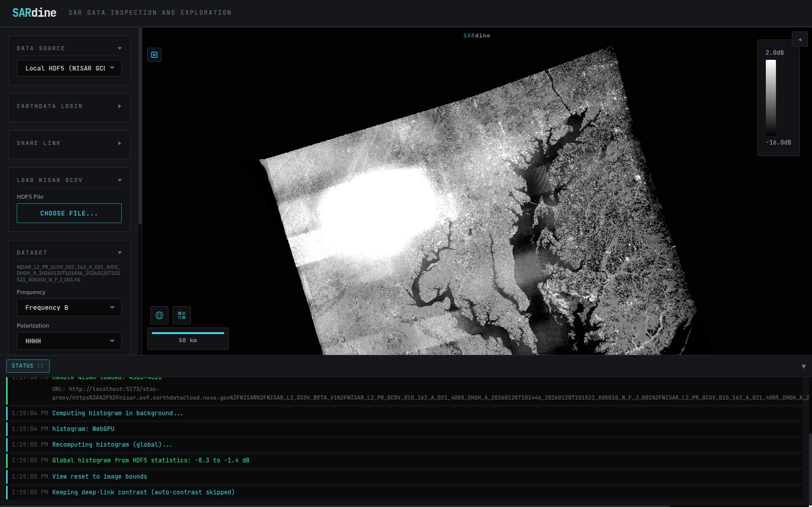

# SARdine NISAR Demo Runbook

Paste a URL, see calibrated NISAR data — no download, no GDAL, no server.

Verified end-to-end 2026-07-10 against live ASF DAAC data with the dual-pol
Chesapeake Bay granule below: paste → metadata + picker in ~7 s, → full-frame
overview pixels in ~40 s cold, seconds on a warm cache.

## What's at ASF DAAC right now

| CMR collection | Granules | Notes |
| :--- | ---: | :--- |
| `NISAR_L2_GCOV_BETA_V1` | ~23,500 | **The data.** Calibrated geocoded backscatter |
| `NISAR_L2_GCOV_PROVISIONAL_V1` | 0 | Registered, not yet populated |
| `NISAR_L2_GCOV_V1` (Validated) | 0 | Registered, not yet populated |

Granule URLs follow this pattern (auth: Earthdata Login):

```text
https://nisar.asf.earthdatacloud.nasa.gov/NISAR/NISAR_L2_GCOV_BETA_V1/<GRANULE>/<GRANULE>.h5
```

Granule-name fields that matter when picking scenes: `DHDH` = dual-pol
(the standard mode, lean files), `QPDH` = quad-pol; `_N_F_` near the end =
nominal full-frame (prefer these — `_N_P_` are partial/mixed-mode frames
with visible seams).

## Prerequisites (one-time)

1. **Earthdata Login token** — <https://urs.earthdata.nasa.gov/profile> →
   "Generate Token". Paste it into SARdine's *Earthdata Login* panel
   (stored in browser localStorage only).
2. `npm run dev` — the Vite dev proxy handles the OAuth redirect chain,
   caches the presigned CloudFront URL, keeps connections alive, and retries
   transient CloudFront 5xx. (Hosted builds use the Cloudflare Worker proxy,
   which still needs the cache/retry/keep-alive parity work.)

## The demo

### Verified demo scene — Chesapeake Bay (dual-pol, full-frame, Jan 2026)

```text
https://nisar.asf.earthdatacloud.nasa.gov/NISAR/NISAR_L2_GCOV_BETA_V1/NISAR_L2_PR_GCOV_010_162_A_021_4005_DHDH_A_20260120T101446_20260120T101521_X05010_N_F_J_001/NISAR_L2_PR_GCOV_010_162_A_021_4005_DHDH_A_20260120T101446_20260120T101521_X05010_N_F_J_001.h5
```

Deep link with a curated stretch (the share-link params pin contrast so the
first paint looks right):

```text
http://localhost:5173/?nisar=<url-encoded .h5 URL above>&min=-16&max=2&db=1
```

Load the default **Frequency B / HHHH** and click **LOAD DATASET**.
Delmarva peninsula, the Bay's dendritic tributaries, and Baltimore–Washington
urban texture render across the full frame:



Talk-track notes: the bright patch in the northwest of the frame is in the
data (beta calibration artifact) — a natural segue to "validated products are
rolling out and will drop straight into this viewer." Alternate scene:
Indus delta coast quad-pol
(`NISAR_L2_PR_GCOV_010_164_D_077_2005_QPDH_A_20260120T140632_..._N_P_J_001`,
partial frame, mostly ocean — see
[demo-2026-07-10-indus-delta.png](images/demo-2026-07-10-indus-delta.png)).

### Frequency A caveat (know before the demo)

Frequency B (~80 m posting) is the browse product — its full-frame overview
is ~80 MB and renders fast. **Frequency A (10 m, 35k×35k) has no pyramids in
the HDF5**: a full-frame overview needs hundreds of MB of chunks and takes
~3 minutes to first pixels (measured 2026-07-10, 1.28 GB fetched). Don't
switch to Frequency A at full-frame zoom during a live demo. Zoomed-in
viewports on Frequency A are cheap (direct chunk reads) — the roadmap fix is
a byte-budgeted progressive overview ladder.

### Finding fresh granules

CMR search is CORS-open (works from the browser and curl):

```bash
curl -s "https://cmr.earthdata.nasa.gov/search/granules.umm_json?\
short_name=NISAR_L2_GCOV_BETA_V1&provider=ASF&sort_key=-start_date&\
bounding_box=<W>,<S>,<E>,<N>&page_size=10&\
options\[readable_granule_name\]\[pattern\]=true&readable_granule_name=*DHDH*_N_F_*"
```

Take `RelatedUrls[].URL` where `Type == "GET DATA"` (the `.h5`).
The in-app *Data Discovery* panel runs the same search.

## Demo beats (suggested script)

1. Open the deep link → the file is **multi-GB, sitting in NASA's cloud
   archive**; SARdine reads ~1–2 % of it via HTTP Range.
2. Status window: chunked Range reads, worker-pool decode, WebGPU
   histogram — all client-side.
3. Drag contrast, switch colormap, toggle dB; switch polarization HHHH → HVHV.
4. Dual-pol RGB composite (HH/HV) with per-channel contrast + histogram.
5. Export a georeferenced GeoTIFF of the view — client-side, seconds.
6. Share link: copy URL with pinned view/contrast, open anywhere — same scene.

## Timing expectations (2026-07-10, ~100 Mbps home connection)

| Step | Cold | Warm (IndexedDB chunk cache) |
| :--- | ---: | ---: |
| Paste → metadata + picker | 6–10 s | ~5 s |
| LOAD DATASET → coarse full-frame pixels (freq B) | 30–45 s | a few seconds |
| Background fine refinement completes | +30–60 s | — |

## Troubleshooting

- **401 / "token may be expired"** — regenerate the EDL token (60-day life).
- **One-off black rectangles in a sub-swath** — a transient CloudFront 500
  poisoned a chunk read; the dev proxy retries these once automatically.
  Reload the dataset if one slips through.
- **Slow first metadata read** — the OAuth redirect chain runs once per
  granule; subsequent Range reads hit the cached presigned URL directly.
- **Washed-out or too-dark first paint** — beta granules vary in brightness;
  pin `&min=…&max=…&db=1` in the link or drag the contrast sliders.
- **Firefox** — WebGPU histogram falls back to CPU automatically; rendering
  (WebGL2) is unaffected.
